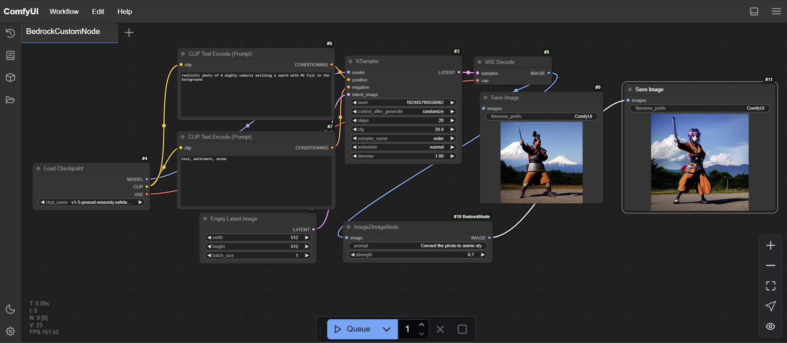

# ComfyUI Bedrock Node

A custom node for ComfyUI that enables image-to-image generation using Amazon Bedrock's Stable Diffusion service.
In the provided example, the node takes the input image from the default ComfyUI workflow along with a text prompt, and a strength value, and returns an image.

## Features

- Image-to-image generation using Stability AI's SD3 model through Amazon Bedrock
- Automatic image resizing to meet model requirements
- Support for customizable prompt and strength parameters
- Seamless integration with ComfyUI workflow

## Prerequisites

- An AWS account with access to Amazon Bedrock
- Proper AWS credentials configured
- Python 3.x
- ComfyUI installed

## Installation

1. Configure your AWS credentials either through:
   - AWS CLI (`aws configure`)
   - Environment variables
   - AWS credentials file

## Usage

1. Launch ComfyUI
2. Find the "Image2ImageNode" in the node browser under the "image" category
3. Connect the node to your workflow with:
   - Input image
   - Text prompt
   - Strength value (0-1)

### Parameters

- **image**: Input image tensor
- **prompt**: Text description for the desired image modification
- **strength**: Float value between 0 and 1 determining how much to modify the original image (default: 0.75)

## Notes

- The node automatically handles image resizing to meet the model's requirements (minimum 640px, maximum 1536px)
- Images are processed maintaining aspect ratio
- The service uses the `stability.sd3-large-v1:0` model from Amazon Bedrock

## Error Handling

The node includes basic error handling and will return a blank image (zeros) if an error occurs during processing.